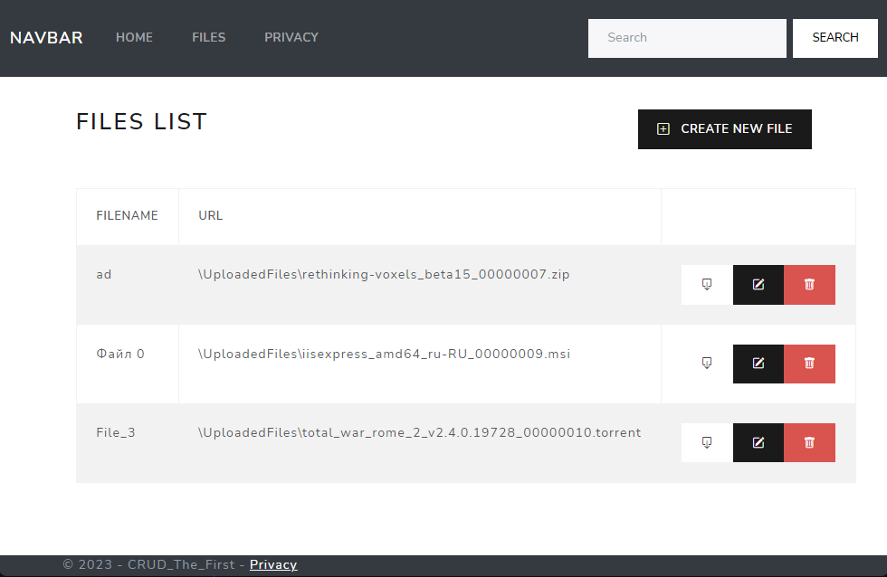

# AnyFiles
	CRUD-приложение, обеспечивающее посредством WEB-интерфейса хранение файлов пользователей, доступ к ним и изменение их свойств в формате списка загруженных файлов.
	Функции:
	- Загрузка файла на сервер
	- Изменение отображаемого имени файла
	- Отображение списка загруженных файлов
	- Скачивание файлов
	- Удаление загруженных файлов

Перечень использованных технологий:
- ASP .NET MVC (.NET 6)
- ORM Entity Framework Core 6
- DB PostgreSQL
- BootStrap 5
- HTML 5

## Visual Demo

@R_Rezak_K
